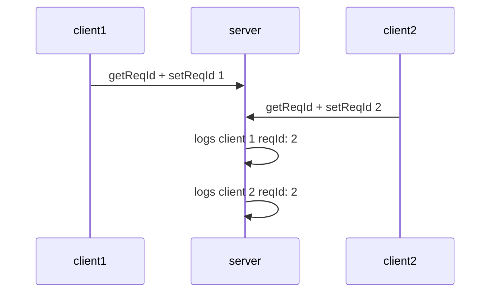

# Rpc communication flow




### Request Id strategy
We DO NOT provide default setReqId and getReqId functions. 

If we have a request id in the header, we use it. If we don't have it, we generate a new one.

```javascript
When server receives message

if reqId in header:
    if setReqId given
        set reqId to the header value
    
    if setReqId Not given
        Do Not Set Req Id
        

if reqId not in header:
    if setReqId given
        set reqId to the random value
    
    if setReqId Not given
        Do Not Set Req Id
```

```javascript
When client sends message

if getReqId is defined:
    if setReqId given
        set reqId to the getReqId value
    
    if setReqId Not given
        Do Not Set Req Id
        

if reqId not in header:
    if setReqId given
        set reqId to the random value
    
    if setReqId Not given
        Do Not Set Req Id
```