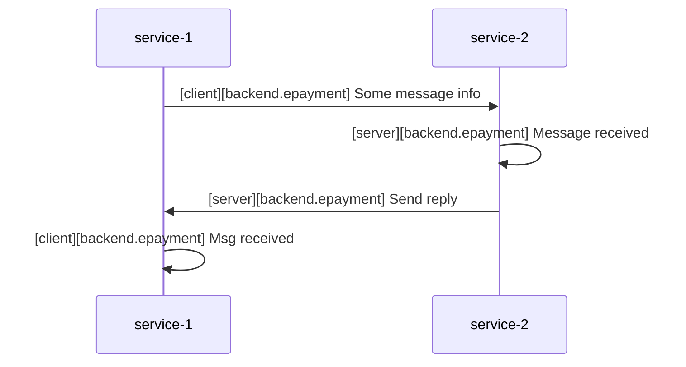

# Rpc communication flow

```mermaid
sequenceDiagram
    service-1->>service-2: [client][backend.epayment] Some message info
    service-2->>service-2: [server][backend.epayment] Message received
    service-2->>service-1: [server][backend.epayment] Send reply
    service-1->>service-1: [client][backend.epayment] Msg received
```
