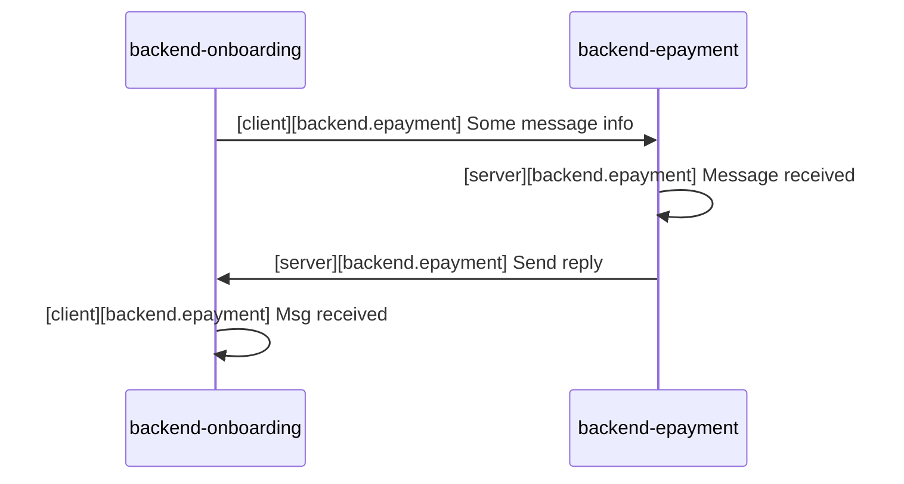

# Rpc communication flow

```mermaid
sequenceDiagram
    backend-onboarding->>backend-epayment: [client][backend.epayment] Some message info
    backend-epayment->>backend-epayment: [server][backend.epayment] Message received
    backend-epayment->>backend-onboarding: [server][backend.epayment] Send reply
    backend-onboarding->>backend-onboarding: [client][backend.epayment] Msg received
```